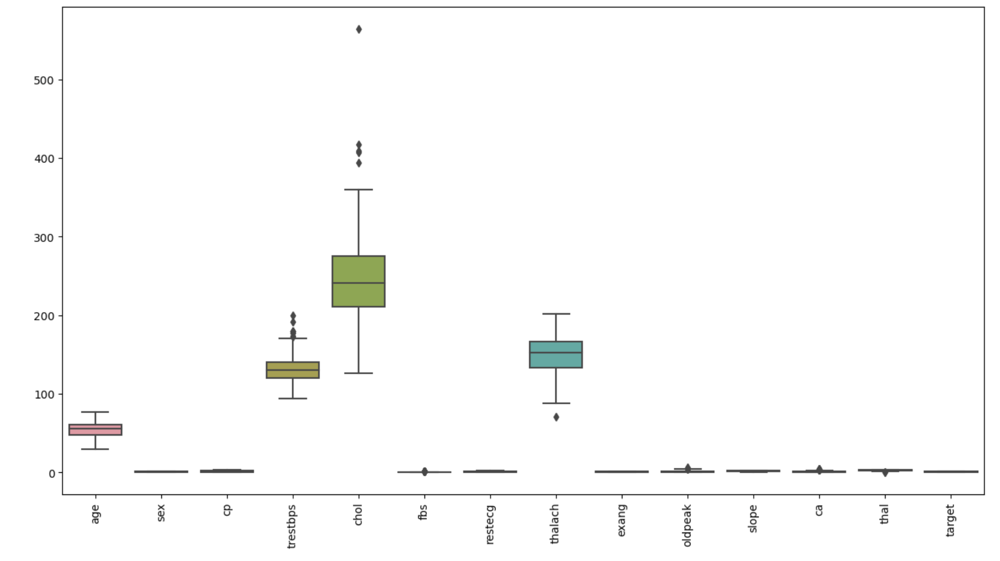
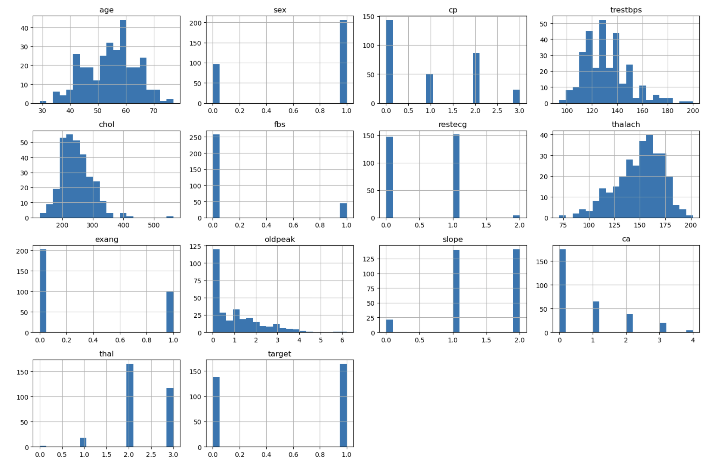
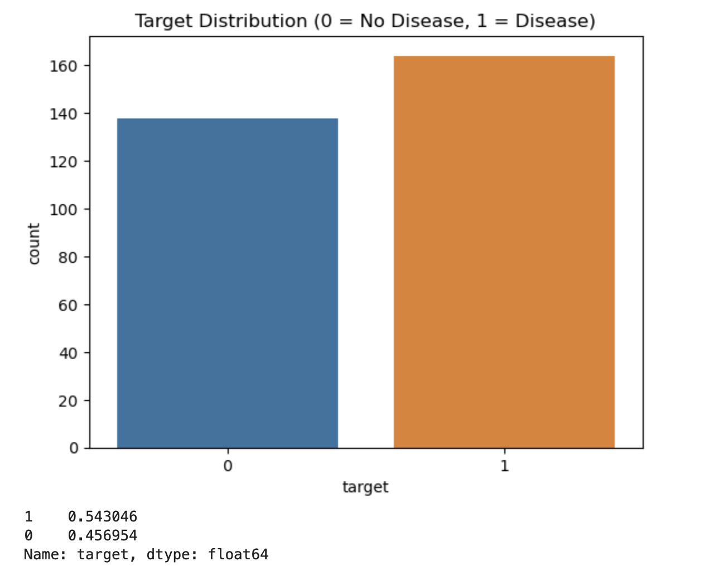
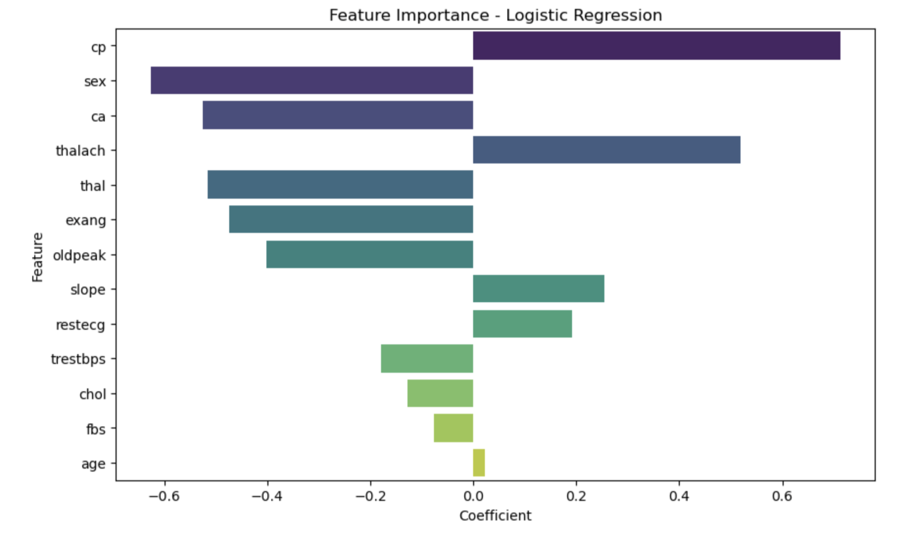

# Heart Disease Prediction — EDA, Modeling & Explainability

This project performs end-to-end exploratory data analysis (EDA), feature engineering, and machine learning modeling on the **UCI Heart Disease dataset**.  
The goal is to build both an **interpretable** and **accurate** model to predict heart disease using clinical features.

---

## 🧠 1. Project Overview

This project includes:

- Full exploratory data analysis  
- Model training & evaluation across 7 algorithms  
- Hyperparameter tuning (GridSearchCV)  
- Explainability using Logistic Regression coefficients & Gini Importance
- Streamlit app for interactive predictions  
- Production-ready model artifacts (scaler, feature order, model weights)  

---

## 📦 2. Dataset Overview

The dataset contains **1025 records** and **14 columns**.  
All features are numeric, and the target variable is binary:

- **0 = No heart disease**
- **1 = Heart disease**

### 🔍 **Columns Description & Mapping**

| Column | Description | Possible Values / Mapping |
|--------|-------------|---------------------------|
| **age** | Age of the patient | Numeric (29–77) |
| **sex** | Patient gender | 0 = Female, 1 = Male |
| **cp** | Chest pain type | 0 = Typical angina  • 1 = Atypical angina  • 2 = Non-anginal pain  • 3 = Asymptomatic |
| **trestbps** | Resting blood pressure (mm Hg) | Numeric |
| **chol** | Serum cholesterol (mg/dl) | Numeric |
| **fbs** | Fasting blood sugar >120 mg/dl | 0 = False, 1 = True |
| **restecg** | Resting electrocardiographic results | 0 = Normal • 1 = ST-T abnormality • 2 = LV hypertrophy |
| **thalach** | Maximum heart rate achieved | Numeric |
| **exang** | Exercise-induced angina | 0 = No, 1 = Yes |
| **oldpeak** | ST depression induced by exercise | Numeric |
| **slope** | Slope of the peak exercise ST segment | 0 = Upsloping • 1 = Flat • 2 = Downsloping |
| **ca** | Number of major vessels coloured by fluoroscopy | 0–4 |
| **thal** | Thalassemia | 0 = Unknown • 1 = Fixed defect • 2 = Normal • 3 = Reversible defect |
| **target** | Heart disease presence | 0 = No disease, 1 = Disease |

---

## 📊 3. Key Results

### ⭐ Best Models

| Model | CV Test Accuracy Mean| ROC-AUC | Notes |
|-------|--------------|----------|-------|
| **Random Forest** | 0.84 | 0.87 | Best overall generalisation |
| **Logistic Regression** | 0.83 | 0.87 | Very interpretable |

### 🔥 Most Influential Features
Common to both LR & RF:

- Chest pain type (cp)
- Number of vessels (ca)
- Maximum heart rate (thalach)
- Thalassemia (thal)
- Exercise-induced angina (exang)

---

## 🖼️ 4. Visuals (EDA + Explainability)







### ⚙️ 5. How to Run
#### 1. Create environment
```bash
python3 -m venv venv
source venv/bin/activate
pip install -r requirements.txt
```
#### 2. Run notebooks
```bash
jupyter notebook notebooks/01_eda.ipynb
```
#### 3. Run Streamlit app
```bash
cd app
./run_app.sh
```

### ⚠️ 7. Limitations
- Dataset is small (only 1025 samples): risk of overfitting.
- Categorical variables encoded numerically may look ordinal when they are not.
- Some medical features (like thal) are inconsistent across dataset versions.
- Some categorical variables are ordinally encoded, which may mislead linear models.
- Medical data may not generalize across global populations.
- Missing values are not present, but some “0” values may actually represent unknowns.
- Model performance may not extrapolate well to:
     - other age groups
    - different hospitals
    - different measurement standards
- The explainability is limited on very small datasets and linear models.

⸻
